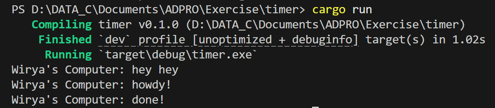

**Nama** : Wirya Dharma Kurnia  
**NPM** : 2306152115  
**Kelas** : Adpro B  

## Reflection

### 1.2: Understanding how it works

Saya menambahkan baris `println!("Wirya's Computer: hey hey")` setelah `spawner.spawn()` pada file `main.rs`. Namun, jika kita lihat dari screenshot outputnya, baris `Wirya's Computer: hey hey` muncul lebih dahulu daripada `Wirya's Computer: howdy!` dan `Wirya's Computer: done`. Hal ini terjadi karena baris `Wirya's Computer: hey hey` berada di luar async block, sehingga akan langsung dieksekusi tanpa dimasukkan ke queue eksekusi. Sementara itu, baris kode yang berada pada async block baru akan dieksekusi ketika berada di line `executor.run()` di paling bawah kode, setelah `println!("Wirya's Computer: hey hey)`. Karena itulah baris `Wirya's Computer: hey hey` akan keluar terlebih dahulu, baru block async akan dijalankan yang kemudian menghasilkan output `Wirya's Computer: howdy!` dan `Wirya's Computer: done`.

### 1.3: Multiple Spawn and removing drop
Output ketika `drop.spawner()` dinonaktifkan (dijadikan komentar):

Output ketika `drop.spawner()` diaktifkan:

Ketika saya menjalankan program dengan kondisi `drop(spawner)` dijadikan komentar, executor tetap menunggu task baru untuk diberikan karena tidak diberi tahu bahwa semua task telah dijalankan. Hal ini dikarenakan fungsi `drop(spawner)` adalah untuk memberi tahu executor bahwa program telah selesai dan tidak akan menerima task lagi. Karena itu, executor.run() akan berjalan dan tidak pernah berhenti secara otomatis sehingga program tidak selesai bahkan setelah semua output telah dikeluarkan. Sementara ketika `drop(spawner)` diaktifkan sebagai kode, executor akan mengeksekusi task yang diberikan dari queue yang ada dan berlanjut ke task selanjutnya jika masih ada, hingga ketika tidak ada lagi task baru yang masuk ke queue maka program akan berhenti dengan normal.

Urutan output akan selalu diawali dengan `Wirya's Computer: hey hey`, kemudian diikuti oleh `Wirya's Computer: howdy!`, `Wirya's Computer: howdy2!`, dan `Wirya's Computer: howdy3!` secara berurutan. Hal ini terjadi karena baris `hey hey` akan dieksekusi secara langsung sebelum masuk ke dalam `executor.run()`, dilanjutkan oleh `howdy`, `howdy2`, dan `howdy3` yang masuk ke dalam queue asynchronous. Sementara itu, untuk urutan keluarnya `done`, `done2`, dan `done3` dapat bervariasi untuk setiap kali program dirun. Alasannya adalah karena masing-masing menggunakan TimerFuture yang menunggu selama 2 detik secara paralel, sehingga hasil urutan output akan bergantung pada scheduler serta timing internal dari eksekusi task tersebut.